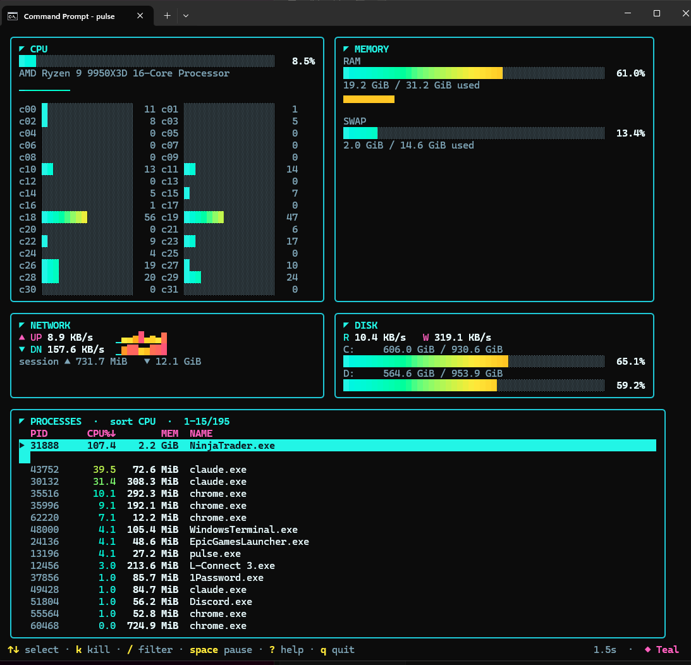

# pulse

A modern, jazzy terminal system monitor — like `htop`/`top`, but with neon gradient
bars, sparklines, and switchable color themes. Built with
[Bubble Tea](https://github.com/charmbracelet/bubbletea) and
[gopsutil](https://github.com/shirou/gopsutil).



## Features

- Live **CPU** (overall + per-core), **memory/swap**, **network** up/down, and
  **disk** usage + read/write I/O.
- **GPU** panel (NVIDIA) with utilization, VRAM, and temperature.
- Per-core bars, sparkline history, and a color gradient that tracks load.
- **CPU temperature** and **battery** when the platform reports them.
- Interactive process list: **sort** by CPU/memory/name/PID, reverse, **scroll**
  with a keyboard or **mouse**, **filter** by name, and **kill** a process.
- **Process details** overlay (`enter`) and a **network connections** overlay (`C`).
- **5 built-in color themes** plus your own (`t` to cycle) — Teal (default), Vapor,
  Matrix, Inferno, Aurora.
- Adjustable refresh rate, pause, and an in-app help overlay.
- Preferences (theme, refresh, sort) persist between runs.

## Install

### Prebuilt binaries

Download the binary for your platform from the
[latest release](https://github.com/cunninghamb505/pulse-tui/releases/latest),
then put it somewhere on your `PATH` (rename it to `pulse` if you like).

On Windows (PowerShell):

```powershell
# after downloading pulse-windows-amd64.exe
Move-Item .\pulse-windows-amd64.exe "$env:USERPROFILE\bin\pulse.exe"
```

On macOS / Linux:

```sh
chmod +x pulse-* && sudo mv pulse-* /usr/local/bin/pulse
```

### With Go (1.21+)

```sh
go install github.com/cunninghamb505/pulse-tui/cmd/pulse@latest
```

This drops the `pulse` binary in your `GOBIN` (usually `$(go env GOPATH)/bin`).
Make sure that directory is on your `PATH`, then just run:

```sh
pulse
```

### Build from source

```sh
git clone https://github.com/cunninghamb505/pulse-tui && cd pulse-tui
go build -o pulse ./cmd/pulse
./pulse
```

## Keys

| Key             | Action                                |
| --------------- | ------------------------------------- |
| `↑` / `↓`       | move selection (or mouse wheel)       |
| click           | select a process row                  |
| `PgUp` / `PgDn` | jump 10 rows                          |
| `g` / `G`       | jump to top / bottom                  |
| `enter`         | process details overlay               |
| `c`/`m`/`n`/`p` | sort by CPU / memory / name / PID     |
| `r`             | reverse sort order                    |
| `k`             | kill selected process                 |
| `C`             | network connections overlay           |
| `/`             | filter by name (`esc` clears)         |
| `space`         | pause / resume                        |
| `+` / `-`       | faster / slower refresh               |
| `t` / `T`       | next / previous theme                 |
| `?`             | toggle help                           |
| `q`             | quit                                  |

## Platforms

| OS      | Battery source                                  | Notes                          |
| ------- | ----------------------------------------------- | ------------------------------ |
| Windows | `GetSystemPowerStatus`                          | Primary / most-tested target.  |
| Linux   | sysfs (`/sys/class/power_supply`)               | Newer — please report issues.  |
| macOS   | `pmset -g batt`                                 | Newer — please report issues.  |

CPU temperature depends on what the OS exposes and may be unavailable
(common on Windows desktops and on cgo-free macOS builds); the UI hides it
when absent. Battery is hidden on machines without one.

## Config

Preferences are stored at `<user config dir>/pulse/config.json`
(e.g. `%AppData%\pulse\config.json` on Windows) and written on quit.

### Custom themes

Add your own themes under a `themes` array in `config.json`. Each needs a name,
the nine palette colors, and at least two gradient stops (low → high load).
Custom themes join the `t` cycle alongside the built-ins:

```json
{
  "themes": [
    {
      "name": "Mono",
      "bg": "#0a0a0a", "dim": "#666666", "text": "#f0f0f0",
      "pink": "#e0e0e0", "cyan": "#cfcfcf", "purple": "#9aa0a6",
      "yellow": "#e8e8e8", "green": "#d0d0d0", "red": "#ff6b6b",
      "grad": ["#5a5a5a", "#9a9a9a", "#d0d0d0", "#f0f0f0"]
    }
  ]
}
```

Invalid entries (bad hex, fewer than two gradient stops) are ignored.
